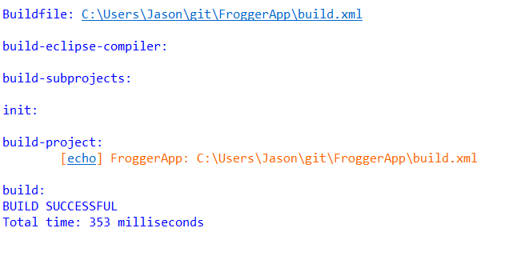

# Frogger Application
Frogger Arcade Application created using javafx and CSS

## Launch
- 30MB of free disk space and above
- 1024x768 pixels with 16-bit video card and above
- JDK 6 Update 13 minimum (JDK 6 Update 14 recommended)
- Javafx library
- Junit 4.0

## Changes made for application

### Git use
- I have used git as my version control activity for my code.
- Below shows some screenshot of my github's repository and history commits.
 
 
 
 

### Refractor
- I have refractored the files into packages in a more meaningful way so that it is well organized.
           

### Break up large class
- Before this, the original code was in only 1 class which was main. Then, I broke down the large class into 3 small classes
while also implementing the MVC architecture to it.
                                                   
                                       
### Encapsulation
- I have improved encapsulation for my variables in all of the classes so that
the variables of a class will be hidden from other classes, and can be accessed only through the methods of their current class.        
     

### Start scene
- I have created a start scene containing 2 buttons which are connected to the game scene and info scene. I have also added a title for the
stage(Frogger Arcade Application).
                                      

### Info scene
- I have created an info scene containing a button which is connected to the game scene. The function of this
info scene is to provide rules and guidelines for players to play to game
 

### 2 Game modes 
- I have created 2 game modes, which is an easy mode and a hard mode.
- Below shows the game scene for easy mode and hard mode.
 **Easy Mode**
 **Hard Mode**
                                      
### Highscore popup
- I have created a highscore popup after the player won the game. 
- The pop up will show the score of the game and top 5 highscore from previous games.
- The highscores are sorted from highest to lowest. 
- The pop up consists of 2 buttons, **Back to Main Menu** means return to menu scene while **Quit game** means quit game
- Below shows the score of 650 points and is added to the highscore popup.
    

### Refractor code
- I have refractor some of the original code by adding some design patterns
- Below shows an example of abstract factory method used. 
- The first image is from the abstract class.
- The second and third image are examples from classes that uses the abstract method.
  
  
  

### MVC architecture
- I have organized the code in a MVC architecture for all of the scenes in my code.
- The MVC architecture consists of model, view and controller.
- First, the application will request data from the controller.
- Then, the controller will get the data from methods in the model.
- After that, the controller will parse the data from the model to view to display on the stage of the application.
- Below shows an example of MVC architecture implement for my menuScene, gameScene and infoScene.
     
                  
### Permanent highscore list    
- I have created a permanent highscore list which stores the highscores inside a .txt file.
- The highscore will be recorded and added after each game.
- Below shows the class and text file that I created to store the highscore using ArrayList.
     

### Add meaningful JUnit test
- I have added 5 jUnit test examples for my code.
- Below shows an example that test the code which does not accept negative score for the game.
    

### Use build files
- I have use Ant build files for my program.
- Below shows the results of my code is build successfully.
   